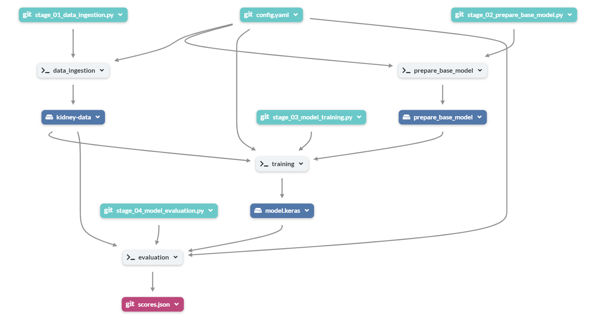

# Kidney CT Scan Image Classification using VGG16

  

This project is an end-to-end deep learning application that uses the VGG16 model for transfer learning to classify kidney CT scan images. The dataset used is sourced from Kaggle. The project also incorporates MLflow and DagsHub for experiment tracking, and DVC for data versioning and pipeline management.

## Experiment-Tracking
 - Dagshub URL : https://dagshub.com/Sidd-77/kidney-disease-classification
 - Mlflow URL: https://dagshub.com/Sidd-77/kidney-disease-classification.mlflow
  


## Tech Stack

  

- **Deep Learning**: TensorFlow, Keras

- **Transfer Learning**: VGG16 model

- **Experiment Tracking**: MLflow, DagsHub

- **Data Versioning**: DVC, GIT

- **Containerization**: Docker

- **Dataset**: [Kaggle CT Kidney Dataset](https://www.kaggle.com/datasets/nazmul0087/ct-kidney-dataset-normal-cyst-tumor-and-stone/data)

## Data Pipeline



## Model Evalutaion


## Setup and Installation 

  

1. Clone the repository:

```shell

git clone https://github.com/Sidd-77/kidney-disease-classification.git

```

  

2. Navigate to the project directory:

```shell

cd kidney-disease-classification

```

  

3. Install the required dependencies:

```shell

pip install -r requirements.txt

```

  

4. Run DVC pipeline:

```shell

dvc repro

```

  
  

## Running the Application

  

1. To train the model, run:

```shell

python main.py

```

  

2. To start the Streamlit application, run:

```shell

streamlit run application.py

```

  

## Docker

  

A Dockerfile is provided if you wish to build a Docker image.

  

1. Build the Docker image:

```shell

docker build -t <image-name>  .

```

  

2. Run the Docker container:

```shell

docker run -p 8501:8501 <image-name>

```

  

The application will be accessible at `http://localhost:8501`.

  

